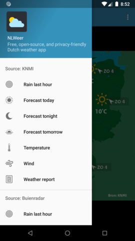
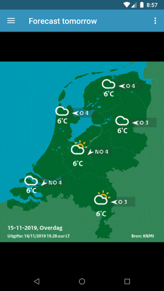

# NLWeer

 

NLWeer is a simple open-source and privacy-friendly Dutch weather app for Android (5.0 or newer). It is free both as in free lunch and as in freedom. The code is MIT licensed. Weather information is provided by KNMI or optionally by Buienradar, see the about screen in the app for more information.

This is what it looks like:

  

  

## Reasons to use NLWeer

Compared to other weather apps for the Netherlands (e.g. Buienradar), here are some reasons to use NLWeer instead:

* It is open-source and can be customized/improved by anyone if needed
* It does not nor never will display commercial advertisements
* It does not require any permissions (except for GPS if explicitly requested)
* It is very lightweight and battery friendly
* It does not require the Google Play Services (e.g. it will run on LineageOS without Google Play or microG)

Features of NLWeer:

* Includes weather maps as well as a written weather report
* Includes weather information from multiple sources
* Three options for localisation (shown as a red circle): manual lon/lat coordinates, mobile service provider, or GPS
* Includes a precipitation prediction graph on your current location
* Languages: English and Dutch

## How to use NLWeer

Requirement is an Android device with version 5.0 (Lollipop, API 21) or newer. You can install it in one of the following ways:

* Download the apk from this repository's release page onto your device and install it
* Install it from the the [F-Droid app store](https://f-droid.org/en/packages/foss.cnugteren.nlweer/)

Note that Buienradar data may only be shown when running on a non-mobile device or if you have explicit permissions. For more information see [the Buienradar website](https://www.buienradar.nl/overbuienradar/gratis-weerdata).
